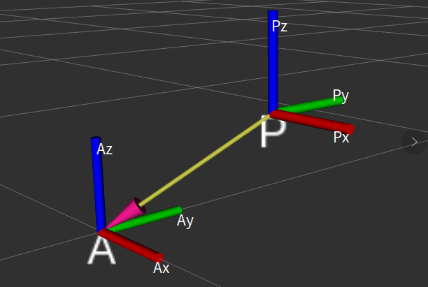
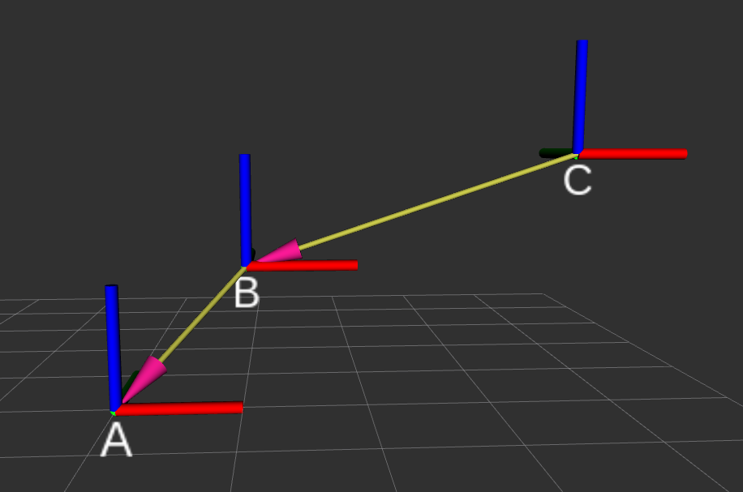

# ROS2 4_机器人学概论

## 1. 位姿的描述

### 位姿关系的建立

首先，为了描述一个物体的位置，需要找到一个参考坐标系。确定参考坐标系后，能够使用空间坐标$(x,y,z)$表示，记为
$$
^AP = \left[\begin{matrix}x \\ y \\ z\end{matrix}\right]
$$


空间中的点同样可以使用矢量表示，将$^AP$用在各个方向的分量进行表示，有
$$
^AP = \left[\begin{matrix}^xp \\ ^yp \\ ^zp\end{matrix}\right]
$$
再以P为原点建立一个新坐标系，通过新坐标系{P}和参考坐标系{A}的姿态关系表示$^AP$点的姿态。



### 旋转矩阵

将{P}的三个轴相对于{A}的三个轴的余弦值组成三阶方阵构成{P}相对于{A}的旋转矩阵：
$$
^A_PR = \left[\begin{matrix} P_x \cdot A_x & P_y \cdot A_x &P_z \cdot A_x \\ P_x \cdot A_y & P_y \cdot A_y & P_z \cdot A_y \\ P_x \cdot A_z & P_y \cdot A_z & P_z \cdot A_z\end{matrix}\right]
$$

> - 如果{P}相对于{A}是平移的，则旋转矩阵为单位阵；
> - 旋转矩阵为正交矩阵。

- 特殊的旋转矩阵：

> 绕x轴旋转*θ*后姿态矩阵
> $$
> R(x,\theta) = \left[\begin{matrix} 1 & 0 & 0 \\ 0 & cos\theta & -sin\theta \\ 0 &sin\theta & cos\theta\end{matrix}\right]
> $$
> 绕y轴旋转*θ*后姿态矩阵
> $$
> R(y,\theta) = \left[\begin{matrix} cos\theta & 0 & sin\theta \\ 0 & 1 & 0 \\ -sin\theta & 0 & cos\theta\end{matrix}\right]
> $$
> 绕z轴旋转*θ*后姿态矩阵
> $$
> R(z,\theta) = \left[\begin{matrix} cos\theta & -sin\theta &  0\\ sin\theta & cos\theta & 0 \\  0& 0 & 1\end{matrix}\right]
> $$

## 2. 坐标变换

### 平移变换



坐标平移方程：
$$
^A_CP = ^A_BP + ^B_CP
$$

### 平移和旋转变换

复合变换方程：
$$
^A_CP = ^A_BR^B_CP + ^A_BP
$$
即为先在参考坐标系中进行旋转变换，再进行平移变换。

## 3. 姿态的表示

### 欧拉角

按照三个轴旋转三个角度（欧拉角），即可得到旋转矩阵，由于矩阵乘法具有不可交换性，则不同旋转顺序会有不同结果。一共有12种旋转顺序。

同时欧拉角还分为固定轴的欧拉角（欧拉式）和非固定轴的欧拉角（卡尔丹式）：固定轴即为按照固定的参考坐标系旋转，非固定轴即为按照多个参考坐标系旋转。

- 欧拉式的旋转矩阵：

$$
^P_AR = R(1,\alpha)R(2,\beta)R(3,\gamma)
$$

1，2，3是按照顺序的旋转轴，$(\alpha,\beta,\gamma)$为欧拉角向量。

### 轴角

么任何姿态都可以通过选择适当的轴和角度得到，换句话说，两个坐标系之间的任何姿态都可以通过绕某一个特定的轴(矢量)旋转特定的角度得到。

轴角对应的旋转矩阵为：
$$
^P_AR = \left[\begin{matrix} 
k_xk_x(1-cos\theta)+cos\theta & k_xk_y(1-cos\theta)-k_zsin\theta & k_xk_z(1-cos\theta) + k_ysin\theta \\
k_xk_y(1-cos\theta)+k_zsin\theta & k_yk_y(1-cos\theta)+cos\theta & k_yk_z(1-cos\theta)-k_xsin\theta \\ 
k_xk_z(1-cos\theta)-k_ysin\theta & k_yk_z(1-cos\theta)+k_xsin\theta &
k_zk_z(1-cos\theta)+cos\theta

\end{matrix}\right]
$$
$K = \left[\begin{matrix} k_x & k_y & k_z \end{matrix}\right]$为轴角单位矢量，$\theta$为旋转角度。

### 四元数

四元数的四个数字由一个实部和三个虚部组成。
$$
q = w + xi + yj +zk
$$
四元数可以用来表示旋转，且能有效地避免欧拉角的死区问题。
$$
^A_PR = \left[\begin{matrix} 
1-2y^2-2z^2 & 2(xy-zw) & 2(xz+yw) \\
2(xy+zw) & 1-2x^2-2z^2 &  2(yz-xw) \\ 
2(xz-yw) & 2(yz+xw) & 1-2x^2-2y^2
\end{matrix}\right]
$$

### 代码实现姿态表示方法的转换

```python
import transforms3d as tfs

# 四元角模块 quaternions
# 欧拉角模块 euler
# 轴角模块 axangles
```

### 齐次变换矩阵

$$
T = \left[\begin{matrix} 
^P_AR & ^P_AP \\ 
0 & 1

\end{matrix}\right]
$$

为齐次变换矩阵，此时，旋转和平移变换均可由其次变换矩阵替代。

矩阵的**左上角标明参考坐标系**，矩阵**左下角标明目标坐标系**。比如$^A_BT$表示B坐标系到A坐标系的变换关系。

齐次变换矩阵是可逆的，$^A_BT^{-1} = ^B_AT$。

> - 齐次矩阵与平移向量相乘，即可求出某个向量在另一坐标系下的表示。
> - 齐次矩阵与齐次矩阵相乘，可以转换不同坐标系之间的关系。

```python
tfs.affines.compose(T,R,[1,1,1]) # 合成齐次变换矩阵

tfs.euler.mat2euler(T[0:3,0:3]),T[:3,3:4] # 分解为固定轴欧拉角和平移向量
tfs.quaternions.mat2quat(T[0:3,0:3]),T[:3,3:4] #  分解为四元数和平移向量
```

## 4. ROS2 TF坐标变换

### TF2 的 CLI 命令

```shell
# x y z 平移矩阵，frame_id 父坐标系（参考坐标系） child_frame_id 子坐标系（目标坐标系）

# 静态坐标广播（四元数方式）
ros2 run tf2_ros static_transform_publisher x y z qx qy qz qw frame_id child_frame_id
# 静态坐标广播（欧拉角方式）
ros2 run tf2_ros static_transform_publisher x y z yaw pitch roll frame_id child_frame_id 

# 监听坐标关系
ros2 run tf2_ros tf2_echo frame_id child_frame_id 

# 查找所有发布者和发布频率
ros2 run tf2_ros tf2_monitor 
```

### 广播发布器实现

> 1. 使用`StaticTransformBroadcaster()`函数构建坐标广播器；
> 2. 使用`TransformStamped()`实例化TF帧；
> 3. 编写TF帧：
>
> > 1. `header.stamp`：TF时间；
> > 2. `header.frame_id`：父坐标系；
> > 3. `child_frame_id`：子坐标系；
> > 4. `transform.translation`：平移坐标；
> > 5. `transform.rotation`：旋转，四元数表示。
>
> 4. 使用`sendTransform()`方法发布TF帧。

```python
import rclpy 
from rclpy.node import Node
# 导入TF帧
from geometry_msgs.msg import TransformStamped
# 导入TF静态坐标发布器
from tf2_ros import StaticTransformBroadcaster
import transforms3d as tfs
import numpy as np

class TF_StaticBroadcaster_Node(Node):
    def __init__(self,name):
        global pitch_degree
        super().__init__(name)
        pitch_degree = 0.0
        # 构造静态坐标广播发布器
        self.tf_publisher = StaticTransformBroadcaster(self)
        self.tf_timer = self.create_timer(1.0,self.timer_callback)

    def timer_callback(self):
        global pitch_degree
        # 构造TF帧
        tf_frame = TransformStamped()
        tf_frame.header.stamp = self.get_clock().now().to_msg()
        ## 父坐标系
        tf_frame.header.frame_id = "base"
        ## 子坐标系
        tf_frame.child_frame_id = "camera"
        ## 坐标变换数据
        tf_frame.transform.translation.x = 2.0
        tf_frame.transform.translation.y = 5.0
        tf_frame.transform.translation.z = 4.0

        pitch_degree = pitch_degree + 1.0

        pitch = float(pitch_degree * (np.pi) / 180)
        roll = float(5 * (np.pi) / 180)
        yaw = float(35 * (np.pi) / 180)

        ## 转换为四元数
        q = tfs.euler.euler2quat(pitch,roll,yaw,"sxyz")
        w = q[0]
        x = q[1]
        y = q[2]
        z = q[3]
        tf_frame.transform.rotation.w = w
        tf_frame.transform.rotation.y = y
        tf_frame.transform.rotation.z = z
        tf_frame.transform.rotation.x = x

        self.tf_publisher.sendTransform(tf_frame)


def main(args=None):
    rclpy.init(args=args)
    node = TF_StaticBroadcaster_Node("TF_StaticBroadcaster_Node")
    rclpy.spin(node)
    rclpy.shutdown()
```

### 广播监听器实现

> 1. `Buffer()`函数创建数据缓冲区；
> 2. `TransformListener()`函数建立广播监听器；
>
> ```python
> """
> 	广播监听器创建函数：
> 	第一个参数：数据缓冲区
> 	第二个参数：节点
> """
> TransformListener()
> ```
>
> 3. 使用`rclpy`的时间创建时间数据。
> 4. 使用数据缓冲区的`lookup_transform()`方法接收坐标变换数据。
>
> ```python
> """
> 	坐标变换数据接收函数
> 	第一个参数：父坐标系
> 	第二个参数：子坐标系
> 	第三个参数：时间
> """
> lookup_transform()
> ```
>
> 5. 判别异常并打印日志。

```python
import rclpy
from rclpy.node import Node
# 导入坐标变换监听器
from tf2_ros import TransformException
from tf2_ros.buffer import Buffer
from tf2_ros.transform_listener import TransformListener

class TF_Listener_Node(Node):
    def __init__(self,name):
        super().__init__(name)
        # 创建缓冲区和监听器
        self.tf_buffer = Buffer()
        self.tf_listener = TransformListener(self.tf_buffer,self)
        self.timer = self.create_timer(1.0,self.timer_callback)
    
    def timer_callback(self):
        try:
            now = rclpy.time.Time()
            trans = self.tf_buffer.lookup_transform('base','camera',now)
            print(trans)
        except TransformException as ex:
            print(f'Not found transform:{ex}')


def main(args=None):
    rclpy.init(args=args)
    node = TF_Listener_Node('TF_Listerner')
    rclpy.spin(node)
    rclpy.shutdown()
```


