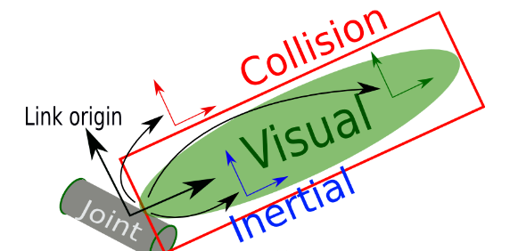

# ROS2 6_机器人建模

## 1. URDF 建模

URDF（Unified Robot Description Format）统一机器人描述格式，URDF使用XML格式描述机器人文件。

XML是**被设计用来传输和存储数据的可扩展标记语言**。

### URDF 的组成

一般情况下，URDF由**声明信息**和两种**关键组件**(`Joint`和`Link`)共同组成。

```xml
<?xml version="1.0"?>
<robot name="robot">
     <link></link>
     <joint></joint>
  ......
</robot>
```

机器人的组件（模块）为连杆`Link`，连杆连接部分称为关节`Joint`。

### Link 连杆



```xml
  <link name="link">

  </link>
```

`Link`的标签定义

| 一级子标签    | 二级子标签   | 三级子标签   | 标签属性   | 标签含义               |
| ------------- | ------------ | ------------ | ---------- | ---------------------- |
| `<visual>`    |              |              |            | 显示形状               |
|               | `<geometry>` |              |            | 几何形状               |
|               |              | `<box>`      |            | 长方体                 |
|               |              |              | `size`     | 长宽高                 |
|               |              | `<cylinder>` |            | 圆柱体                 |
|               |              |              | `radius`   | 半径                   |
|               |              |              | `length`   | 高度                   |
|               |              | `<sphere>`   |            | 球体                   |
|               |              |              | `radius`   | 半径                   |
|               |              | `<mesh>`     |            | 第三方模型文件         |
|               |              |              | `filename` | 文件名                 |
|               | `<origin>`   |              |            | 连杆原点               |
|               |              |              | `xyz`      | 平移量                 |
|               |              |              | `rpy`      | 翻滚角，俯仰角，偏航角 |
|               | `<material>` |              |            | 材质                   |
|               |              | `<name>`     |            | 名字                   |
|               |              | `<color>`    | `rgba`     | 颜色                   |
| `<collision>` |              |              |            | 碰撞属性               |
| `<inertial>`  |              |              |            | 惯性参数               |

### Joint 关节


`Joint`的标签定义

| 属性   | 子标签     | 标签属性 | 含义                                                         |
| ------ | ---------- | -------- | ------------------------------------------------------------ |
| `name` |            |          | 关节名称                                                     |
| `type` |            |          | 关节类型：  <br>revolute: 旋转关节，绕单轴旋转,角度有上下限,比如舵机;<br>continuous: 旋转关节，可以绕单轴无限旋转,比如自行车的前后轮;<br>fixed: 固定关节，不允许运动的特殊关节;<br>prismatic: 滑动关节，沿某一轴线移动的关节，有位置极限;<br>planer: 平面关节，允许在xyz，rxryrz六个方向运动;<br>floating: 浮动关节，允许进行平移、旋转运动 |
|        | `<parent>` | `link`   | 父连杆名称                                                   |
|        | `<child>`  | `link`   | 子连杆名称                                                   |
|        | `<origin>` | `xyz`    | 原点关系（平移）                                             |
|        | `<axis>`   | `xyz`    | 旋转轴                                                       |

## 2. URDF 建模代码编写

### 创建并编写URDF文件

在功能包下创建`urdf`文件夹，创建`.urdf`文件。

```xml
<?xml version="1.0"?>
<robot name="fishbot">
    
    <!-- base link -->
    <link name="base_link">
        <visual>
            <origin xyz="0 0 0.0" rpy="0 0 0"/>
            <geometry>
                <cylinder length="0.12" radius="0.10"/>
            </geometry>
            <material name="blue">
                <color rgba="0.1 0.1 1.0 0.5"/>
            </material>
        </visual>
    </link>
    
    <!-- laser link -->
    <link name="laser_link">
        <visual>
            <origin xyz="0 0 0" rpy="0 0 0"/>
            <geometry>
                <cylinder length="0.02" radius="0.02"/>
            </geometry>
            <material name="black">
                <color rgba="0.0 0.0 0.0 0.8" /> 
        </material>
        </visual>
    </link>

    <!-- imu link -->
    <link name="imu_link">
        <visual>
            <origin xyz="0 0 0" rpy="0 0 0"/>
            <geometry>
                <box size="0.02 0.02 0.02"/>
            </geometry>
        </visual>
  </link>
    
    <!-- laser joint -->
    <joint name="laser_joint" type="fixed">
        <parent link="base_link" />
        <child link="laser_link" />
        <origin xyz="0 0 0.075" />
    </joint>

    <!-- imu joint -->
    <joint name="imu_joint" type="fixed">
        <parent link="base_link" />
        <child link="imu_link" />
        <origin xyz="0 0 0.02" />
    </joint>

</robot>
```

### 编写Launch文件

在功能包下创建`launch`文件夹，编写`.launch.py`文件。

```python
import os
from launch import LaunchDescription
from launch.substitutions import LaunchConfiguration
from launch_ros.actions import Node
from launch_ros.substitutions import FindPackageShare


def generate_launch_description():
    package_name = 'robot_description'
    urdf_name = "robot_base.urdf"

    ld = LaunchDescription()
    pkg_share = FindPackageShare(package=package_name).find(package_name) 
    urdf_model_path = os.path.join(pkg_share, f'urdf/{urdf_name}')
	# 模型发布节点
    robot_state_publisher_node = Node(
        package='robot_state_publisher',
        executable='robot_state_publisher',
        arguments=[urdf_model_path]
        )
	# 关节数据发布节点
    joint_state_publisher_node = Node(
        package='joint_state_publisher_gui',
        executable='joint_state_publisher_gui',
        name='joint_state_publisher_gui',
        arguments=[urdf_model_path]
        )
	# rviz2 节点
    rviz2_node = Node(
        package='rviz2',
        executable='rviz2',
        name='rviz2',
        output='screen',
        )

    ld.add_action(robot_state_publisher_node)
    ld.add_action(joint_state_publisher_node)
    ld.add_action(rviz2_node)

    return ld

```

> 可视化模型需要三个节点参与:
>
> - `joint_state_publisher_gui` 负责发布机器人关节数据信息，通过`joint_states`话题发布。
> - `robot_state_publisher_node`负责发布机器人模型信息，`robot_description`，并将`joint_states`数据转换`tf`信息发布。
> - `rviz2_node`负责显示机器人的信息。
>
> > 如果未能安装，使用以下命令：
> >
> > ```shell
> > sudo apt install ros-$ROS_DISTRO-joint-state-publisher-gui ros-$ROS_DISTRO-robot-state-publisher
> > ```
> >
> > 如果无法打开可视化界面，使用以下命令：
> >
> > ```shell
> > xhost +
> > ```
>
> 

### 编写`setup.py`文件

```python
from setuptools import find_packages, setup
from glob import glob
import os


package_name = 'urdf_robot_create'

setup(
    name=package_name,
    version='0.0.0',
    packages=find_packages(exclude=['test']),
    data_files=[
        ('share/ament_index/resource_index/packages',
            ['resource/' + package_name]),
        ('share/' + package_name, ['package.xml']),
        # 添加以下代码
        (os.path.join('share', package_name, 'launch'), glob('launch/*.launch.py')),
        (os.path.join('share', package_name, 'urdf'), glob('urdf/**')),
    ],
    install_requires=['setuptools'],
    zip_safe=True,
    maintainer='root',
    maintainer_email='e22750706642022@163.com',
    description='TODO: Package description',
    license='TODO: License declaration',
    tests_require=['pytest'],
    entry_points={
        'console_scripts': [
        ],
    },
)
```

