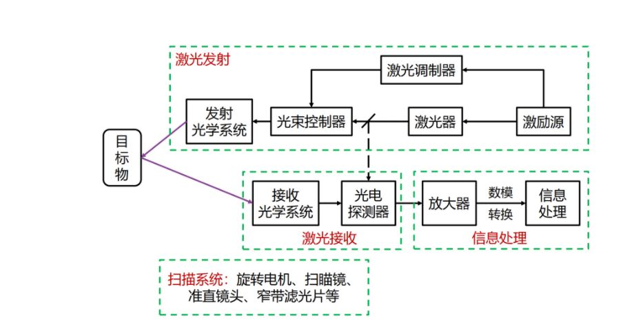
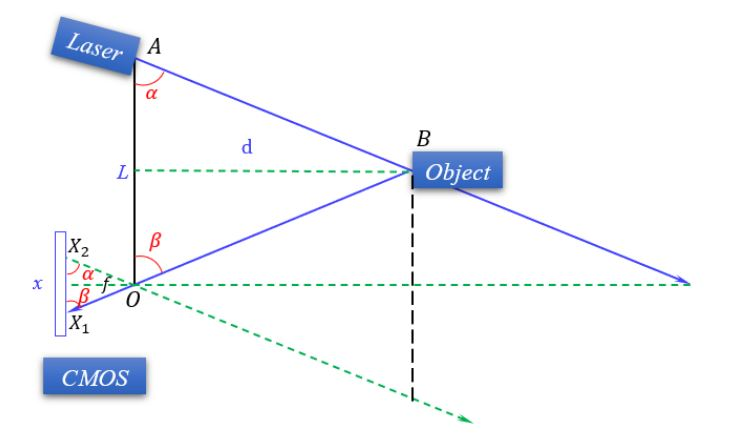

# ROS2 8_机器人传感器

## 1. 激光雷达

### 激光雷达测距原理

激光雷达是一种通过发射激光束探测目标的位置、速度等特征量的雷达系统。激光波段位于0.5μm-10μm，以光电探测器为接收器件，以光学望远镜为天线。



#### 三角测距法

三角测距的实现相对简单。



激光发射器(Laser)发射激光，照射到物体(Object)表面时，反射至相机(CMOS)处，经过相机的焦点与图像传感器交于$X_1$.

由几何相似关系易得

$$
d = \frac{Lf}{x}
$$
$f$为CMOS相机的焦距大小，$L$为激光发射器与CMOS的间距。

$x$可由三角函数得到
$$
x = \frac{f}{tan\alpha} + \frac{f}{tan\beta}
$$
$\alpha$为激光发射器发射角度，角度$\beta$可由相机内参矩阵计算得到。

则
$$
d = L\frac{sin\alpha sin\beta}{sin(\alpha + \beta)}
$$

***当测量物体较远，即d值较大时，所引起的x变化较小，精度较差。***

#### TOF测距法


飞行时间（Time of flight）利用光速进行测距，若激光发射器在$t_0$
时刻发射一束激光，打到物体上并反射，在$t_1$时刻激光接收器接收到，则测量距离可用如下表达式计算：

$$
d = c_0\frac{t_1 - t_0}{2}
$$
$c_0$为光速。

由于光速过快，对计时器精度要求高，测量精度1m对应时间精度ns；测量精度cm则对应时间精度ps。

为了能较好地测量时间差，一般适用相位差进行计算
$$
\Delta t  = \frac{\Delta \phi}{2 \pi f_m}
$$
$\Delta \phi$为激光收发波形相位差，$f_m$为一个周期的频率。

***当测量物体较近，即d值较小时，由于对计时器精度较高，故而测量精度一般。***

### 激光雷达扫描原理

由于激光雷达需要处于旋转状态，所以激光雷达与底座不能直接连接，一般使用滑环和光磁耦合方式连接。

滑环是机械触点，旋转时触点始终保持接触，实现电路的连接和导通，使用时间过长会磨损。机械触点旋转时会发出噪声。

光磁耦合通过电磁感应连接，模块和底座之间会有一一对应的发光二极管和光电二极管用于光通信。

- 单线激光雷达

单线激光雷达的扫描区域处于同一平面内，又叫做2D激光雷达。

- 多线激光雷达

多线激光雷达可以实现对不同平面区域的扫描，又叫3D激光雷达。

## 2. 激光雷达的驱动

激光雷达经过转接板，通过网口或者串口连接到上位机，通常的，厂家会提供驱动例程。

### 单线激光雷达

单线激光雷达会向上位机发布话题名称为`\scan`的消息，此消息为`sensor_msg_msgs/msg/Laserscan`类型的消息，消息格式如下：

```
#
# 测量的激光扫描角度，逆时针为正
# 设备坐标帧的0度面向前（沿着X轴方向）
#

Header header
float32 angle_min        # scan的开始角度 [弧度]
float32 angle_max        # scan的结束角度 [弧度]
float32 angle_increment  # 测量的角度间的距离 [弧度]
float32 time_increment   # 测量间的时间 [秒]
float32 scan_time        # 扫描间的时间 [秒]
float32 range_min        # 最小的测量距离 [米]
float32 range_max        # 最大的测量距离 [米]
float32[] ranges         # 测量的距离数据 [米] (注意: 值 < range_min 或 > range_max 应当被丢弃)
float32[] intensities    # 强度数据 [device-specific units]
```

```python
import rclpy
from rclpy.node import Node
# 导入Laserscan消息数据
from sensor_msgs.msg import LaserScan

class LaserScan_Read_Node(Node):
    def __init__(self, name):
        super().__init__(name)
        self.subscriber = self.create_subscription(LaserScan,'/scan',self.subscriber_callback,10)

    def subscriber_callback(self,msg):
        distance = msg.ranges[180]
        self.get_logger().info(f'distance:{distance}')

def main(args=None):
    rclpy.init()
    node = LaserScan_Read_Node("LaserscanNode")
    rclpy.spin(node)
    rclpy.shutdown()
```

